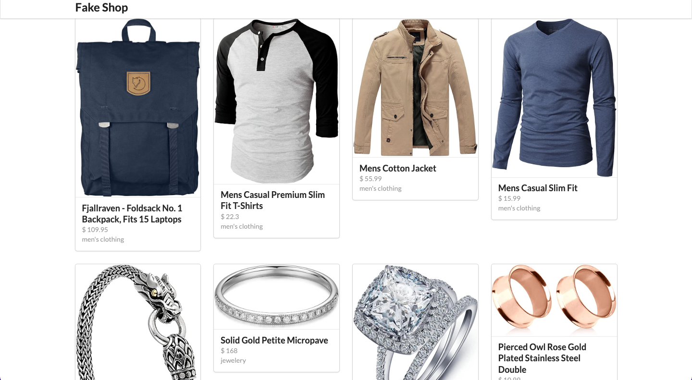

<table align="right">
  <tr>
    <td>
      <a href="README-EN.md">🇺🇸 English (only in GitHub)</a>
    </td>
  </tr>
  <tr>
    <td>
      <a href="README.md">🇧🇷 Português</a>
    </td>
  </tr>
</table>

# FakeShop

Fakeshop is a virtual e-commerce store.There, you can access a product and see its details.

## 🔨 Project features

FakeShop is an online e-commerce. For the design, the semantic UI framework was used, providing more time for the development of state management. Using axios, accessing the page of each product makes the API call easy to read. Using redux in the app, i fixed the concepts before bringing them to the company's projects that I work. Typescript comes as icing on the cake adds robustness to the project.

## ⚙️ Techniques and technologies used

Check out this list of everything we will use in this app:

- `React`
- `Vite`
- `TypeScript`
- `Redux`
- `Semantic UI`
- `Axios`
- `GitHub`

## 🛠️ Open and run the project

To open and run the project, run `npm i` to install the dependencies and `npm run dev` to start the project.

Then go to <a href="http://localhost:3000/">http://localhost:3000/</a> in your browser.

## 📚 More tutorial information

Fakeshop is a fictitious virtual e-commerce developed from the [Dipesh Malvia](https://www.youtube.com/@DipeshMalvia) tutorial. The main idea of ​​this tutorial implementation is to further evolve knowledge in React and the redux state management tool, implementing reducers, actions and action-types.

| :placard: Vitrine.Dev |                                                                          |
| --------------------- | ------------------------------------------------------------------------ |
| :sparkles: Name       | **Fake Shop**                                                            |
| :label: Technologies  | React, TypeScript,Redux, Semantic Ui, Axios, GitHub ( used Technologies) |
| :rocket: URL          | https://react-redux-ecommerce-boibfst0v-cristianmeelo.vercel.app/        |
| :fire: Challenge      | https://www.youtube.com/watch?v=0W6i5LYKCSI&ab_channel=DipeshMalvia      |
