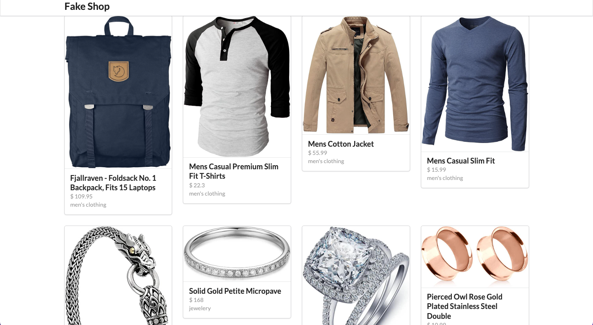

<table align="right">
  <tr>
    <td>
      <a href="README-en.md">🇺🇸 English (apenas no GitHub)</a>
    </td>
  </tr>
  <tr>
    <td>
      <a href="README.md">🇧🇷 Português</a>
    </td>
  </tr>
</table>

# FakeShop

A Fakeshop é uma loja virtual de e-commerce. Lá, você pode acessar um produto e ver seus detalhes.

## 🔨 Recursos do projeto

FakeShop é um e-commerce online. Para o design, foi utilizado o framework semântico de UI, proporcionando mais tempo para o desenvolvimento do gerenciamento de estado. Usando axios, acessar a página de cada produto facilita a leitura da chamada da API. Utilizando o redux no app, fixei os conceitos antes de trazê-los para os projetos da empresa que trabalho. O typescript vem como a cereja no topo do bolo e adiciona robustez ao projeto.

## ⚙️ Técnicas e tecnologias usadas

Confira essa lista de tudo que vamos usar nesse app:

- `React`
- `Vite`
- `TypeScript`
- `Redux`
- `Semantic UI`
- `Axios`
- `GitHub`

## 🛠️ Abra e execute o projeto

Para abrir e executar o projeto, execute `npm i` para instalar as dependências e `npm run dev` para iniciar o projeto.

Em seguida, vá para <a href="http://localhost:3000/">http://localhost:3000/</a> em seu navegador.

## 📚 Mais informações do tutorial

Para abrir e executar o projeto, execute `npm i` para instalar as dependências e `npm run dev` para iniciar o projeto.

Fakeshop é um e-commerce virtual fictício desenvolvido a partir do tutorial [Dipesh Malvia](https://www.youtube.com/@DipeshMalvia). A ideia principal da implementação deste tutorial é evoluir ainda mais o conhecimento em React e na ferramenta de gerenciamento de estado redux, implementando redutores, ações e tipos de ação.

| :placard: Vitrine.Dev |                                                                             |
| --------------------- | --------------------------------------------------------------------------- |
| :sparkles: Nome       | **Fake Shop**                                                               |
| :label: Tecnologias   | React, TypeScript,Redux, Semantic Ui, Axios, GitHub(tecnologias utilizadas) |
| :rocket: URL          | https://react-redux-ecommerce-boibfst0v-cristianmeelo.vercel.app/           |
| :fire: Desafio        | https://www.youtube.com/watch?v=0W6i5LYKCSI&ab_channel=DipeshMalvia         |
